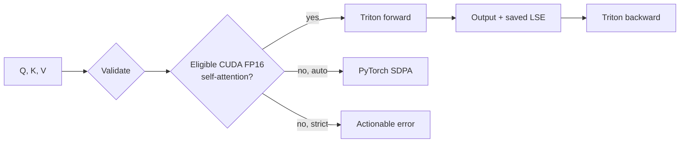

# Architecture and algorithm

## System boundary

The project has two layers:

1. `scaled_dot_product_attention` validates the public contract and chooses a
   backend.
2. `TritonAttention` connects the custom forward/backward kernels to PyTorch
   autograd.

The dispatcher is intentional. A fast kernel with silent layout or dtype
assumptions is a correctness bug waiting to happen. `backend="auto"` uses the
custom kernel only for the shape family it was designed for;
`backend="triton"` is strict and useful for tests and benchmarks.



## Forward: tiled online softmax

Ordinary attention computes

```text
S = scale · QKᵀ
P = softmax(S)
O = PV
```

Materializing `S` or `P` costs `O(N²)` memory. The Triton kernel assigns one
program to a block of query rows and streams K/V blocks through SRAM.

For the current tile `j`, it keeps three row-wise quantities:

```text
m_new = max(m_old, rowmax(S_j))
alpha = exp(m_old - m_new)
l_new = alpha · l_old + rowsum(exp(S_j - m_new))
O_new = alpha · O_old + exp(S_j - m_new) V_j
```

After the last K/V tile:

```text
O = O_accumulator / l
LSE = m + log(l)
```

Only `LSE`, one FP32 value per query row, is saved for backward.

### Why `exp2`

GPU hardware has an efficient base-2 exponential path. The kernel uses:

```text
exp(x) = exp2(x / ln(2))
```

It therefore multiplies the normal softmax scale by `1 / ln(2)` before
`exp2`. Backward includes `ln(2)` in the derivative and applies the reciprocal
scale once outside the tile loop. Missing either correction produces plausible
but wrong gradients, which is why the CUDA suite checks `dQ`, `dK`, and `dV`,
not only the forward output.

## Backward: recompute probabilities, not the matrix

Let `dO` be the upstream gradient and define:

```text
Delta_i = rowsum(O_i ⊙ dO_i)
P_ij = exp(S_ij - LSE_i)
dS_ij = P_ij · (dP_ij - Delta_i)
```

The small preprocess kernel calculates `Delta`. The main kernel reconstructs
one probability tile at a time and accumulates:

```text
dV = Pᵀ dO
dQ = scale · dS K
dK = scale · dSᵀ Q
```

This trades extra arithmetic for far less high-bandwidth-memory traffic—the
central FlashAttention idea.

## Causal traversal

The baseline visited every backward tile and multiplied the upper triangle by
zero. That preserves correctness but wastes compute.

For a causal matrix, the new kernel handles:

1. the block diagonal, where an element-wise triangular mask is required;
2. only the fully valid tiles below that diagonal.

For `dQ`, a resident query tile visits K/V tiles to its left. For `dK` and
`dV`, a resident K/V tile visits query tiles below it. The upper-right tile
region is never launched inside either loop.

```text
          K / V tiles →
Q tiles   D . . .
  ↓       V D . .
          V V D .
          V V V D

D = diagonal tile (element mask)
V = fully valid tile
. = never visited
```

The exact saving includes diagonal overhead, but it approaches 50% of tile work
as sequence length grows.

## Arbitrary sequence lengths

The launch grid uses ceiling division. Every load/store at the final sequence
tile carries a validity mask, and invalid key columns receive `-∞` before
softmax. This matters twice:

- zero-padding keys without masking would change the normalization;
- an invalid final query row must never write output, LSE, or gradients.

Lengths just across tile boundaries—17, 65, and 129—are therefore more useful
tests than only powers of two.

## Grouped-query attention

If there are `Hq` query heads and `Hkv` K/V heads:

```text
group_size = Hq / Hkv
kv_head = query_head // group_size
```

Forward and `dQ` are independent per query head. Multiple query-head programs
contribute to the same `dK` and `dV`, so the GQA path uses atomic additions.
That is simple and correct, but it has two tradeoffs worth discussing:

- atomic order makes the final low bits nondeterministic;
- for very large group sizes, a two-stage reduction may outperform atomics.

The benchmark exposes `--kv-heads` so that this decision can be measured.

## Autotuning

Forward tunes query tile size, pipeline stages, and warp count. Backward tunes
macro/micro tile sizes plus stages and warps. The cache key includes sequence
length, head dimension, and causality.

Autotuning has a first-call cost, so benchmarks warm the kernel before measuring
steady state. GQA backward also declares `dK` and `dV` as reset-to-zero buffers
during tuning; without that, repeated candidate runs would accumulate gradients
and corrupt the result.

## Complexity and limitations

| Property | Naive attention | This kernel |
| --- | ---: | ---: |
| Algorithmic compute | `O(BHN²D)` | `O(BHN²D)` |
| Attention intermediate memory | `O(BHN²)` | `O(BHN)` |
| Causal backward tile visits | full square | lower triangle + diagonal |

Current custom-path limitations are FP16, NVIDIA Ampere-or-newer, head
dimensions 32/64/128, self-attention, and no dropout/arbitrary masks. The
dispatcher routes supported PyTorch cases around most shape/device limitations;
dropout and arbitrary masks are not yet exposed.
